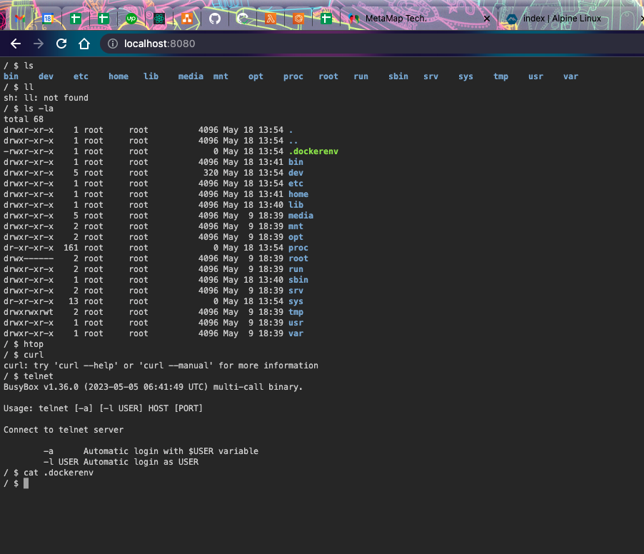
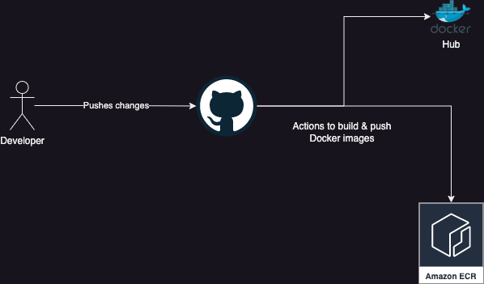

 


# Efimeral Docker images

All available images for Efimeral project. Different OSs, same purpose: a raw
Linux box free to use on browser with full control.



The container does NOT have access to root for security reassons; the default
is `box` and it cannot install new packages.

Available tools:

* vim
* htop
* curl
* zsh
* [busybox utilities](https://busybox.net/)

See available tags on [Docker Hub](https://hub.docker.com/r/ariel17/efimeral-images/tags).

## Architecture



GitHub actions are executed on main branch pushes. Docker Hub for public image
access and ECR for private infrastructure.

### Docker Hub secrets

* DOCKERHUB_TOKEN
* DOCKERHUB_USERNAME

### AWS ECR secrets

* AWS_ACCESS_KEY_ID
* AWS_REGION
* AWS_SECRET_ACCESS_KEY
* ECR_REPOSITORY_NAME

## AWS ECR login for Docker

```bash
# export AWS_REGION=xxxx
# export AWS_ACCOUNT_ID=xxx
aws ecr get-login-password --region $AWS_REGION | docker login --username AWS --password-stdin $AWS_ACCOUNT_ID.dkr.ecr.$AWS_REGION.amazonaws.com
```

## Technologies

* [Alpine Linux](https://www.alpinelinux.org/): Alpine Linux is a
  security-oriented, lightweight Linux distribution based on musl libc and
  busybox.
* [ttyd](https://github.com/tsl0922/ttyd): Share your terminal over the web.

## Related projects

* [Efimeral API](https://github.com/ariel17/efimeral-api)
* [Efimeral web](https://github.com/ariel17/efimeral-web)
